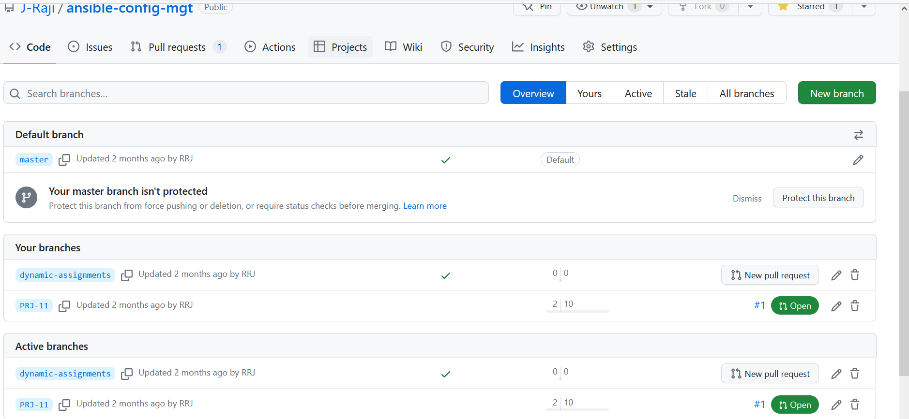
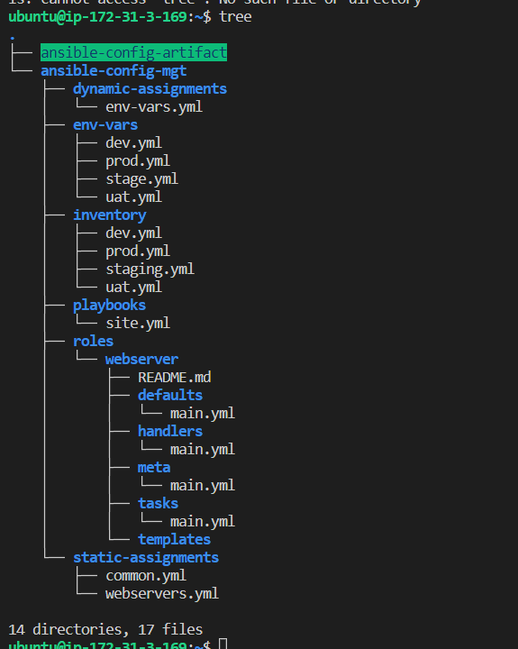
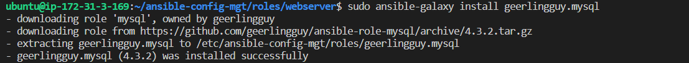

# Ansible Dynamic Assignments (Include) and Community Roles

[] In 

[] Create a new Branch dynamic-assignments



[] create a folder with dynamic-assignments

`mkdir dynamic-assignments`

`cd dynamic-assignments` 

[]CLone 

`git clone git@github.com:J-Raji/Project-12.git` 

[]create file env-vars.yml 

`sudo vi env-vars.yml` 

[]with

``
---
- name: collate variables from env specific file, if it exists
  hosts: all
  tasks:
    - name: looping through list of available files
      include_vars: "{{ item }}"
      with_first_found:
        - files:
            - dev.yml
            - stage.yml
            - prod.yml
            - uat.yml
          paths:
            - "{{ playbook_dir }}/../env-vars"
      tags:
        - always

``

`cd ..`

[] Create env-vars directory and 

`mkdir env-vars` 

`cd env-vars` 

[]create dev.yml,prod.yml,stage.yml and uat.yml

`sudo vi dev.yml`

`sudo vi stage.yml` 

`sudo vi uat.yml`

`sudo vi prof.yml`

[] check directory

`tree` 



## Update site.yml with dynamic assignments

[]Update site.yml with

``
---
- hosts: all
- name: Include dynamic variables 
  tasks:
  import_playbook: ../static-assignments/common.yml 
  include: ../dynamic-assignments/env-vars.yml
  tags:
    - always

-  hosts: web1-uat, web2 uat
- name: Webserver assignment
  import_playbook: ../static-assignments/webservers.yml

  ``
## Community Roles

[]Install MYSQL

`sudo apt install mysql-server`

[]Open mysql

`sudo mysql` 

[]Create MYSQL Database with roles

```
CREATE DATABASE TOOLING;
CREATE USER `webaccess`@`172.31.3.169` IDENTIFIED BY 'mypass';
ALTER USER 'root'@'172.31.3.169' IDENTIFIED WITH mysql_native_password BY 'PassWord.1';
GRANT ALL ON tooling.* TO 'webaccess'@'172.31.3.169';
FLUSH PRIVILEGES;
```

## Download ansible role

`sudo ansible-galaxy install geerlingguy.ansible `

[]confirm version of git

`git --version`

`sudo apt update`

[] run

``git init
git pull https://github.com/J-Raji/Project13.git
git remote add origin https://github.com/J-Raji/Project13.git
git branch roles-feature
git switch roles-feature
``
[]Inside ROLES DIECTORY
`cd ansible-congif-mgt/roles`

[]create an MYSQL role

`sudo ansible-galaxy install geerlingguy.mysql`



[]Rename folder to mYSQl
`mv geerlingguy.mysql/ mysql`

`cd ansible-config-mgt/roles/webservers/README.md` 

[]Read the README.md file and insert the role configuration to use the correct credentials to the tooling website

`sudo vi README.md`
hosts:172.31.3.169
username:admin
admin password d84735f4243e4faf8ea684558518804e

[]Update changes to github

`git config --global --edit`

[]Uncomment 

#name=ubuntu
#email=ubuntu@ip-172-31-3-169.us-east-2.comput.internal

After,

git commit --amend --reset-author

[]Create a pull request amd merge

### Load balancer roles

`cd defaults`

`sudo main.yml`

[] define vars enable_nginx_lb and enable_apache_lb for Nginx and Apache_lb respectively

`-var:enable_nginx_lb(false),enable_apache_lb(false)`

[] Set values to false

[]Declare another role, both roles load_balancer_is_required and set its value to false as we

`` 
-role:
  Name: load_balancer_is_required(false)
 ``

  []Update site.yml

  `cd ansible-config-mgt/playbooks`

  []with

``
    - name: Loadbalancers assignment
       hosts: lb
         - import_playbook: ../static-assignments/loadbalancers.yml
        when: load_balancer_is_required 

``
[]Update loadbalancer.yml (env-vars.yml)

`cd ansile-config-mgt/dynamic-assignments`

[] In the env-vard directory

`cd env-vars`

[]Update env-vars/uat.yml

`` 
enable_nginx_lb: true
load_balancer_is_required: true

``


